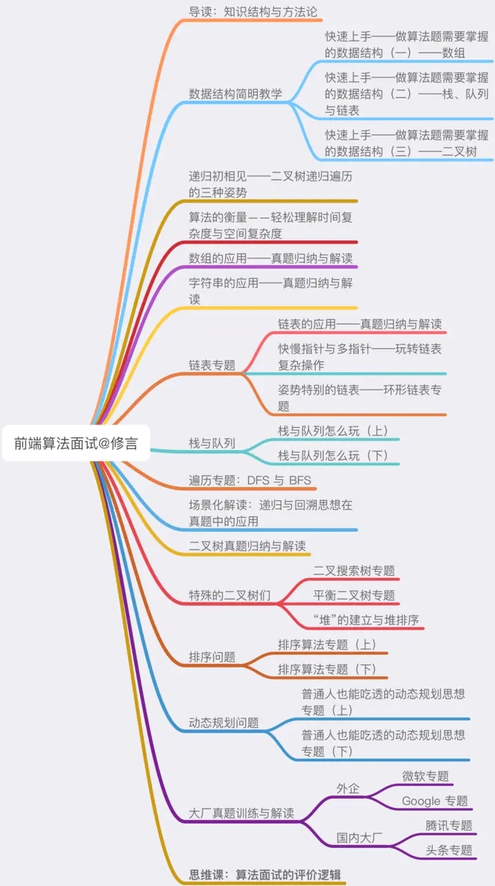

# 前端算法与数据结构

[掘进小册](https://juejin.im/book/6844733800300150797/section/6844733800283373575)

一个观念

前端工程师如果不是为了买时, name不建议花大力气折腾算法(尤其是在业余时间本身非常有限的情况下), 应该考虑吧更多的时间用来做工程.

所谓的工程能力, 本质是"解决问题的能力", 无论是硬编码能力, 还是架构思想, 其本质是为了解决问题这个终极目标而服务.

TODO: [设计模式](https://juejin.im/book/6844733790204461070), [前端性能优化](https://juejin.im/book/6844733750048210957)


- 克服能力短板

算法题目能够又快又好的帮助前端团队达到各种各样的招聘目的(逻辑思维能力, 聪明度)

一次学习, 终生受用.

- 算法能力并非少数人的专利

揣摩出题人的意图, 研究不同题目类型的分布情况和考察频率, 研究如何在不会的题目上拿分, 这样只针对面试, 只解决问题的"专注模式", 在前端面试这个维度上可以所向披靡, 加上工程化能力提升, 在整体面试结果上甚至会好绿竞赛选手.




## 基础知识

- 数组
  - 推荐使用new Array(x)(指定数组长度).  `const arr = new Array(7).fill(1)`
  - 循环
    - for(推荐, 性能更高)
    - forEach
    - map
  - 二维数组
  - 常用API
    - push/unshift/splice
    - pop/shift/splice
- 栈
  - 后进先出 LIFO (Last in First Out)
  - 常用API
    - pop / push
- 队列
  - 先进先出 FIFO
  - 常用API
    - push/shift
- 链表
  - 离散存储, 节点
  - 基本结构
  ```js
    function ListNode(val) {
      this.val = val;
      this.next = null;
    } 
  ```
  - 链表和数组的辨析
  > 假设数组的长度是n, 那我因增加/删除操作导致需异动的元素数量, 就会随着数组长度n的增大而增加, 呈一个线性关系. 所以说数组增加/删除操作对应的复杂度是O(n)
    - js中不一定, 如果纯数字, 对应的内存确实是连续的, 如果定义了不同类型, 对应的就是一段非连续的内存`const arr = ['haa', 1, {a: 1}]`
    - 相对于数组, 链表有一个明显的优点, 就是**添加和删除元素都不需要异动多余的元素**
    - 高效的增删操作
      - 链表中, 添加和删除操作的复杂度是固定的, 只需要改变前驱/后继节点的指针指向. 因此我们说链表增删操作的复杂度是常数级别的复杂度, 即O(1)
    - 麻烦的访问操作
      - 链表获取节点, 必须通过遍历, 时间复杂度O(n),数组直接通过索引取值, 时间复杂度O(1)
- 树(二叉树)
  - 根节点, 叶子节点, 边
  - 层次计算规则: 根节点所在那一层记为第一层, 子节点为第二层, 以此类推
  - 节点和树的"高度": 叶子节点高度记为1, 每向上一层高度加1. 树中的节点的最大高度, 称为"树的高度"
  - "度"的概念: 一个节点开叉出去多少个子树, 被称为节点的"度"
  - 叶子节点: 叶子节点就是度为0的节点


## 二叉树遍历

### 先序遍历, 中序遍历, 后续遍历

- 先序遍历: 根节点-> 左子树 -> 右子树
- 中序遍历: 左子树 -> 根节点 -> 右子树
- 后续遍历: 左子树 -> 右子树 -> 根节点

### 使用Map, 以空间换时间

> 真题描述： 给定一个整数数组 nums 和一个目标值 target，请你在该数组中找出和为目标值的那 两个 整数，并返回他们的数组下标。

```
给定 nums = [2, 7, 11, 15], target = 9
因为 nums[0] + nums[1] = 2 + 7 = 9 所以返回 [0, 1]
```

### 双指针法

双指针法，定位效率将会被大大提升，从此告别过度循环~
双指针法的使用场景了，一方面，它可以做到空间换时间；另一方面，它也可以帮我们降低问题的复杂度。

双指针法用在涉及求和、比大小类的数组题目里时，大前提往往是：该数组必须有序。

#### 合并两个有序数组

> 真题描述：给你两个有序整数数组 nums1 和 nums2，请你将 nums2 合并到 nums1 中，使 nums1 成为一个有序数组。输入: nums1 = [1,2,3,0,0,0], m = 3; nums2 = [2,5,6], n = 3; 输出: [1,2,2,3,5,6]


#### 三数求和

> 真题描述：给你一个包含 n 个整数的数组 nums，判断 nums 中是否存在三个元素 a，b，c ，使得 a + b + c = 0 ？请你找出所有满足条件且不重复的三元组。
> 给定数组 nums = [-1, 0, 1, 2, -1, -4]， 满足要求的三元组集合为： [ [-1, 0, 1], [-1, -1, 2] ]

#### 双指针法中的"对撞指针"法

左右指针一起从两边往中间位置相互迫近, 这样的特殊双指针形态, 被称为"对撞指针".

什么时候需要联想到对撞指针?

两个关键字: **有序**和**数组**

### 字符串

#### 反转字符串

```js
str = str.split('').reverse().join()
```

#### 是否回文

回文特性: 从中间位置"劈开", 两边的两个淄川在内容上完全对称

```js
// 使用反转字符串判断
return str === str.split('').reverse().join()

// 使用回文特性判断
const len = str.length;

for(let i = 0; i < len / 2; i++) {
  if(str[i] !== str[len - 1 -i]) {
    return false
  }
}
  return true
```

##### 真题

> 真题描述：给定一个非空字符串 s，最多删除一个字符。判断是否能成为回文字符串。

解法:

1.  使用遍历, 遍历到哪个字符串, 删除哪个字符, 然后判断剩下的是否为回文(时间复杂度: O(n), 空间复杂度O(1))
2.  使用双指针(有关键字: **对称性**和**双指针**) 时间复杂度(nlogn, 空间复杂度O(n)) 


字符串题干中若有“回文”关键字，那么做题时脑海中一定要冒出两个关键字——对称性 和 双指针

#### 正则表达式

> 真题描述： 设计一个支持以下两种操作的数据结构：
> void addWord(word)
>  bool search(word)
>  search(word) 可以搜索文字或正则表达式字符串，字符串只包含字母 . 或 a-z 。
>  . 可以表示任何一个字母。

#### 正则表达式更进一步——字符串与数字之间的转换问题

> 请你来实现一个 atoi 函数，使其能将字符串转换成整数。

该函数会根据需要丢弃无用的开头空格字符，直到寻找到第一个非空格的字符为止。
当我们寻找到的第一个非空字符为正或者负号时，则将该符号与之后面尽可能多的连续数字组合起来，作为该整数的正负号；假如第一个非空字符是数字，则直接将其与之后连续的数字字符组合起来，形成整数。