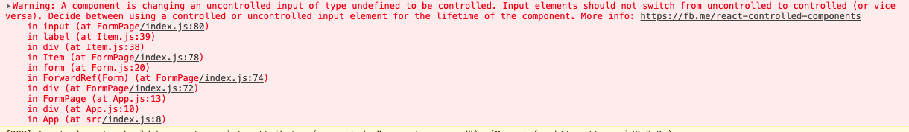

## TODO

1. 表单resetFieldsValue方法实现
2. 在使用getFieldDecorator时, 使用两次(username, password), 控制台打印, 调用了8次
3. 了解forceUpdate API
4. onClick={} 花括号中配置 `this.xxx` || `()  => this.xxx`

## Fixed

1. 执行引入my-rc-form, Form组件初始化了两次
   
   **原因: App.js中使用了`<React.StrictMode> <App /> </React.StrictMode>`**

   分析: [onstructor 会执行两次？- 浅淡 React StrictMode](https://juejin.im/post/5e64d3eff265da57671bd080)

2. 使用React.cloneElement 复制表单标签设置value值时使用了`value: getFieldValue(name)`或者在页面直接使用input标签如下: `<input placeholder="username" />` 
   
   控制台会有警告如下:
  解决办法: [设置初始值](https://stackoverflow.com/questions/47012169/a-component-is-changing-an-uncontrolled-input-of-type-text-to-be-controlled-erro)
  `value: getFieldValue(name) || ''` 或者 `<input value='' placeholder="username" />`
  
3.  在使用getFieldDecorator时, 使用两次(username, password), 控制台打印, 调用了8次(两个原因)
    原因一: 见Fixed-1
    原因二:
        1.  页面RcFormPage render方法里调用了两次, 分别生成username, password
        2.  RcFromPage里调用setFieldValue设置了username的默认值, 导致组件props修改, 进而造成重新render, 在render里再次调用getFieldDecorator, 所以默认至此会调用四次

        优化措施: TODO:
         在rcFrom里增加缓存措施, 当再次更新时触发已存在的组件的更新.


## 知识点


### fuction 表单页面
- useRef, useEffect 自定义Hook useForm

### class 表单页面
- React.createRef / React.forwardRef / React.useImperativeHandle

### dialog
- createProtalAPI


-  useEffect, useLayoutEffect


-  为什么 hooks 方法返回值为函数?
   返回值为函数, 方便用户根据索引来解构对象, 如果返回值为对象, 则key固定, 开发不友好

-  [useReducer](https://zh-hans.reactjs.org/docs/hooks-reference.html#usereducer)
   传入一个redux的reducer方法, 和初始值
   ```js
   const initialState = {count: 0};

   function reducer(state, action) {
      switch (action.type) {
         case 'increment':
            return {count: state.count + 1};
         case 'decrement':
            return {count: state.count - 1};
         default:
            throw new Error();
      }
   }

   function Counter() {
   const [state, dispatch] = useReducer(reducer, initialState);
   return (
      <>
         Count: {state.count}
         <button onClick={() => dispatch({type: 'decrement'})}>-</button>
         <button onClick={() => dispatch({type: 'increment'})}>+</button>
      </>
   );
   }
   ```